<picture>
  <source media="(prefers-color-scheme: dark)" srcset=".github/readme/banner-dark.svg">
  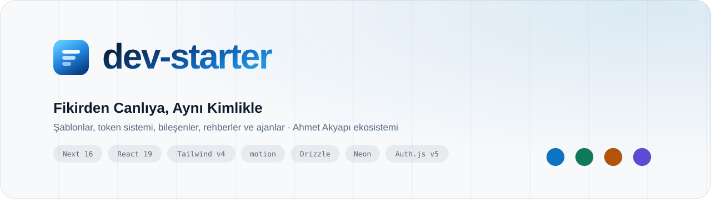
</picture>

<p align="center">
  <a href="https://github.com/ahmetakyapi/dev-starter/actions/workflows/ci.yml"></a>
  
  
  
  
  <a href="https://www.npmjs.com/package/@ahmetakyapi/theme"></a>
  <a href="LICENSE"></a>
</p>

**dev-starter**, bütün projelerimin başladığı yer ve ortak hafızası. Bir fikri
piyasa taramasından geçirip plana çeviren ajanlar, güncel yığınla (Next 16,
Tailwind v4, motion) hazır şablonlar, her projede aynı kalan bir marka kimliği,
kopyalanabilir bileşenler ve ilk günden canlıya kadar sırayla izlenen rehberler
burada. Yaşanmış her hata, karar ve desen kaydediliyor; komutlar ve ajanlar her
makinede tek kaynaktan kuruluyor.

<table>
<tr>
<td width="25%" align="center"><h3>11</h3>Rehber</td>
<td width="25%" align="center"><h3>5</h3>Kayıtlı Ajan</td>
<td width="25%" align="center"><h3>10</h3>Komut</td>
<td width="25%" align="center"><h3>93</h3>Kayıtlı Hata</td>
</tr>
</table>

---

## 60 Saniyede Başla

```bash
# Yeni makine: komutları, ajanları, global kuralları ve skill'leri kurar
git clone https://github.com/ahmetakyapi/dev-starter ~/Desktop/Projects/dev-starter
bash ~/Desktop/Projects/dev-starter/machine/bootstrap.sh
```

Sonra herhangi bir klasörde Claude Code içinde:

```text
/kickoff ergoterapistler için seans takip uygulaması
```

`strategist` ajanı birkaç soru sorar, piyasayı tarar, 2-3 yön önerir, teknolojiyi
seçer ve `docs/KICKOFF.md` yazar. Onay verdiğinde `/new-project` şablonu kurar,
paleti uygular ve ilk doğrulamayı koşar.

---

## Fikirden Canlıya

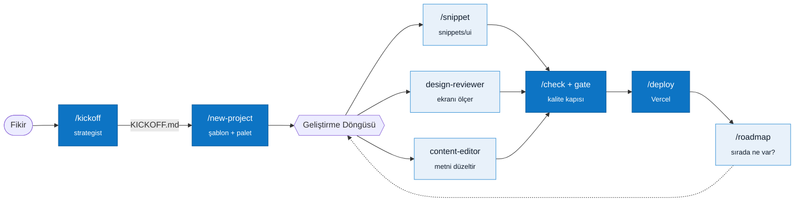

---

## Marka Kimliği: Kimlik Ortak, Palet Projeye Göre

Her proje aynı **mantıkla** kurulur: iki katmanlı token, tonla derinlik, tek
hareket eğrisi, aynı bileşen davranışı. Değişen tek şey **palet**. Varsayılan
`signature` paleti, Açılış Zili'nin lacivertten maviye uzanan ailesi.

<picture>
  <source media="(prefers-color-scheme: dark)" srcset=".github/readme/palettes-dark.svg">
  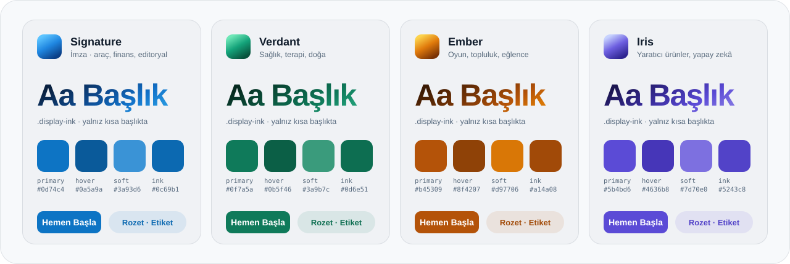
</picture>

| Her Projede Aynı | Projeye Göre Seçilen |
|---|---|
| Rol adlı token'lar (`--text-strong`, `--surface`, `--primary-ink`) | Vurgu ailesi (`--primary` ve türevleri) |
| Derinlik gölgeyle değil ton farkıyla; glass yalnızca bilinçli seçimle | Zemin ve metnin hafif renk eğilimi |
| Degrade yalnızca üç yerde: kısa başlık, birincil CTA, marka karosu | Display ve marka degradesi |
| Tek değişken font ailesi, rol adlı punto ölçeği, Title Case | Font eşleşmesi ([`snippets/fonts`](snippets/fonts)) |
| Tek eğri, aynı süreler, `prefers-reduced-motion` | Varsayılan tema (gündüz aracı açık, gece ürünü koyu) |

Paletler `tokens.ts`'te tanımlı ve her palet × tema kombinasyonu WCAG AA
kontrastına göre **test ediliyor** (`npm test`). Yukarıdaki görseller de aynı
dosyadan üretiliyor; token değişip görsel güncellenmezse CI kırılıyor.
→ [`guides/00-brand-identity.md`](guides/00-brand-identity.md)

---

## Hareket Dili

<picture>
  <source media="(prefers-color-scheme: dark)" srcset=".github/readme/motion-dark.svg">
  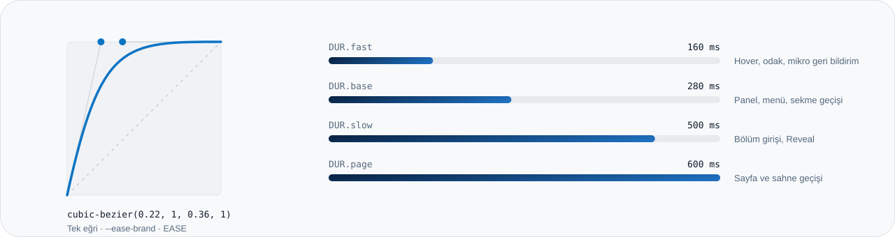
</picture>

`motion/react` + `LazyMotion` (yalnızca kullanılan özellikler iner), tüm geçişler
tek eğriyle, reduced-motion her yerde. LCP başlığı asla görünmez başlamaz; Reveal
SSR'da görünür kalır. → [`guides/04-motion.md`](guides/04-motion.md)

---

## Şablonlar

| Şablon | Ne Zaman | İçinde |
|---|---|---|
| [`nextjs-fullstack`](templates/nextjs-fullstack) | Ürün, panel, kullanıcılı uygulama | Next 16 · Auth.js v5 + `proxy.ts` · Neon + Drizzle (tembel bağlantı) · zod env · güvenlik başlıkları · 6 test dosyası · CI |
| [`landing`](templates/landing) | Tanıtım sayfası, portfolyo | Aynı sistem katmanı · 7 hero düzeni · içerik tek dosyada (`lib/content.ts`) · JSON-LD · OG |
| [`agentic-chat`](templates/agentic-chat) | Yapay zekâ ajanı arayüzü (overlay) | AG-UI + CopilotKit, sabitlenmiş sürümler, senaryo testleri |
| [`docs/`](templates/docs) | Her proje | KICKOFF · PRODUCT · ROUTEMAP · ARCHITECTURE · SCREENS · DESIGN |

İki uygulama şablonu da temiz kurulumdan `build`, `typecheck`, `lint` ve `test`
ile doğrulanıyor.

### Hero Kataloğu

Landing şablonunda yedi hero düzeni var; `lib/content.ts` içinde `hero.variant`
tek satırla değiştirilir. Görseller GitHub temana göre açık ya da koyu gelir.

<table>
<tr><td width="50%" valign="top"><picture><source media="(prefers-color-scheme: dark)" srcset=".github/readme/shots/hero-live-data-dark.webp">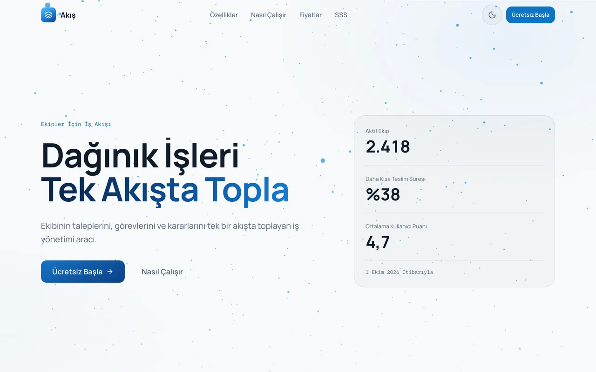</picture><br><b>Canlı Veri</b> · <code>live-data</code><br><sub>Ölçülebilir bir vaat ve sayıların gerçek kaynağı varsa. Varsayılan.</sub></td><td width="50%" valign="top"><picture><source media="(prefers-color-scheme: dark)" srcset=".github/readme/shots/hero-statement-dark.webp">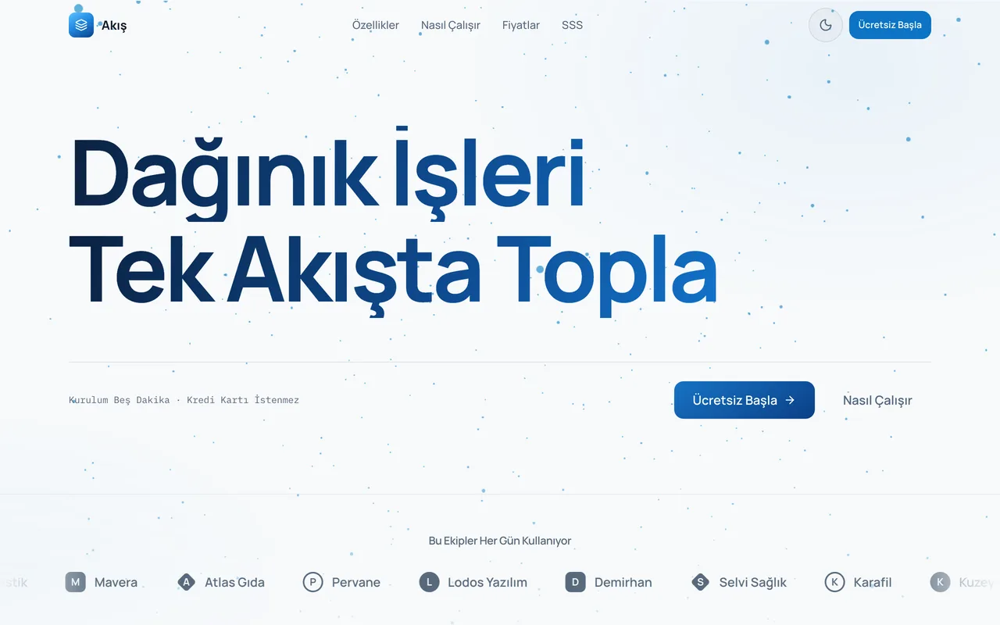</picture><br><b>Bildiri</b> · <code>statement</code><br><sub>Mesaj tek başına güçlüyse: lansman, manifesto.</sub></td></tr>
<tr><td width="50%" valign="top"><picture><source media="(prefers-color-scheme: dark)" srcset=".github/readme/shots/hero-editorial-split-dark.webp">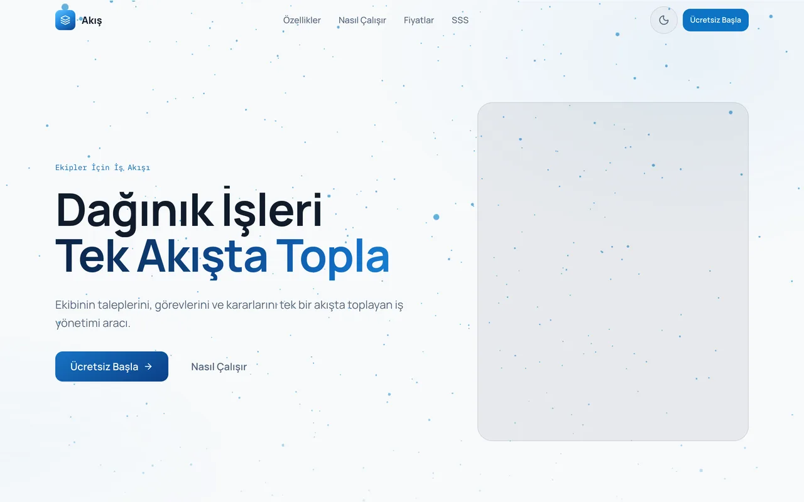</picture><br><b>Editoryal İkiye Bölünmüş</b> · <code>editorial-split</code><br><sub>Gösterilecek gerçek bir ürün ekranı ya da fotoğraf varsa.</sub></td><td width="50%" valign="top"><picture><source media="(prefers-color-scheme: dark)" srcset=".github/readme/shots/hero-product-frame-dark.webp">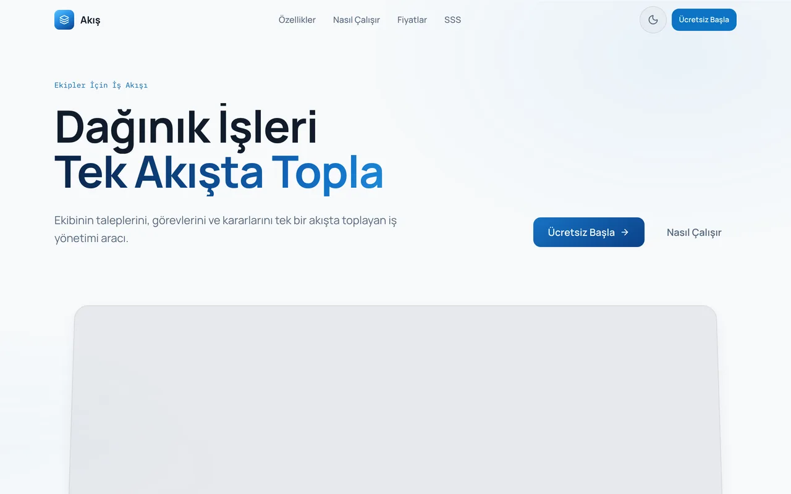</picture><br><b>Ürün Çerçevesi</b> · <code>product-frame</code><br><sub>Satışı arayüzün kendisi yapıyorsa; çerçeve kaydırdıkça düzleşir.</sub></td></tr>
<tr><td width="50%" valign="top"><picture><source media="(prefers-color-scheme: dark)" srcset=".github/readme/shots/hero-bento-dark.webp">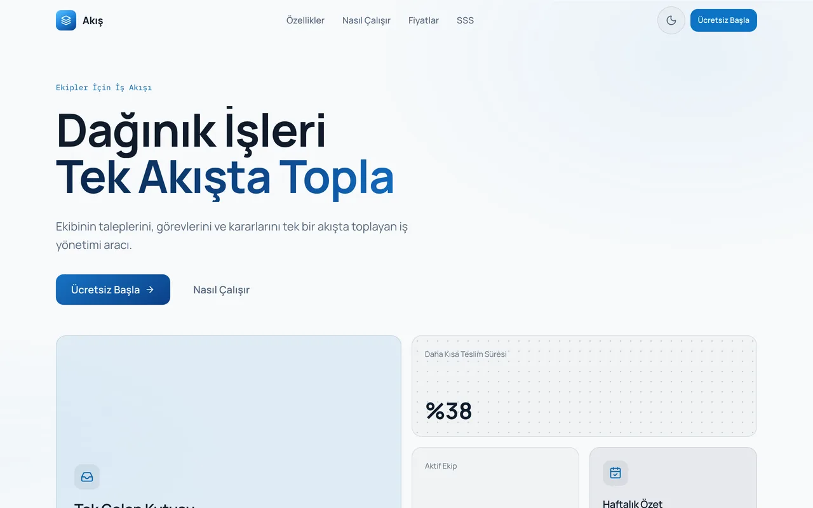</picture><br><b>Bento</b> · <code>bento</code><br><sub>Eşit ağırlıkta 3-5 güçlü yön varsa.</sub></td><td width="50%" valign="top"><picture><source media="(prefers-color-scheme: dark)" srcset=".github/readme/shots/hero-scroll-stage-dark.webp">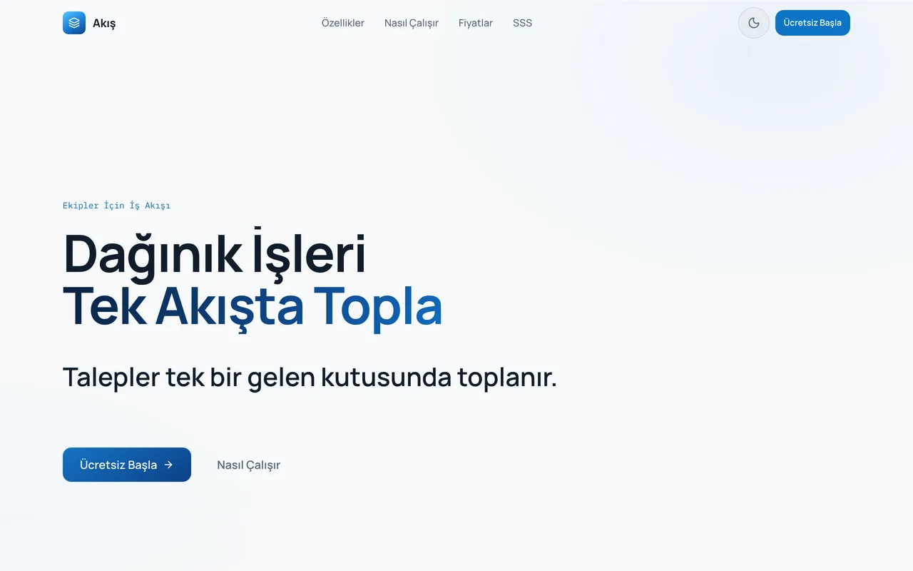</picture><br><b>Kaydırma Sahnesi</b> · <code>scroll-stage</code><br><sub>Hikâye üç adımda anlatılabiliyorsa.</sub></td></tr>
<tr><td width="50%" valign="top"><picture><source media="(prefers-color-scheme: dark)" srcset=".github/readme/shots/hero-minimal-dark.webp">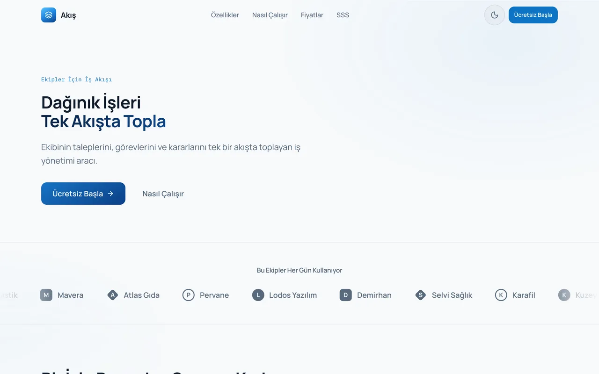</picture><br><b>Minimal</b> · <code>minimal</code><br><sub>İçerik ağırlıklı sayfalar: blog, belge, rehber.</sub></td><td width="50%" valign="top"></td></tr>
</table>

<details>
<summary><b>Tüm Sayfa ve Telefon</b></summary>
<br>
<table><tr>
<td width="68%" valign="top">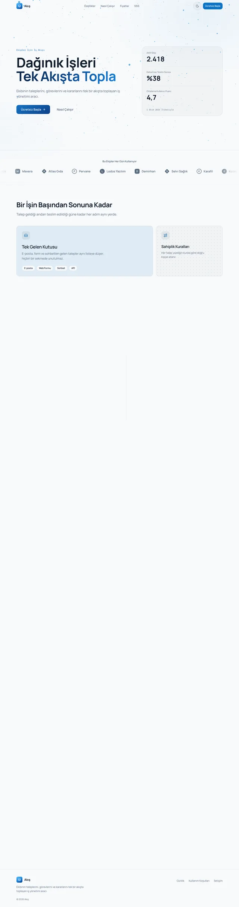</td>
<td width="32%" valign="top">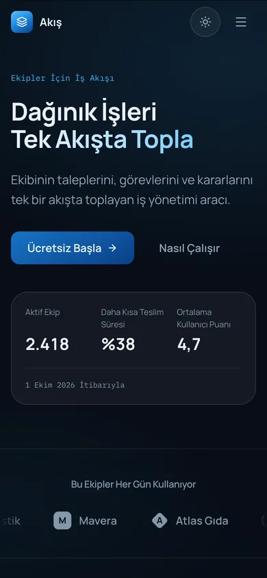</td>
</tr></table>
</details>

---

## Bileşenler

Kopyala-yapıştır kütüphane: her dosya tek başına projeye girer, yalnızca token
sınıflarına ve `cn()`'e dayanır, açık/koyu ve dört palette doğru görünür.
`/snippet <ad>` uyarlayarak kopyalar.

| Grup | Bileşenler |
|---|---|
| **Yükleme** | `spinner` · `loading-mark` · `route-progress` · `skeleton` |
| **Düğme ve İkon** | `icon` · `icon-button` (`aria-label` tipte zorunlu) · `button-group` · `segmented-control` · `copy-button` · `kbd` |
| **Katmanlar** | `dialog` · `sheet` (yerel `<dialog>`) · `popover` · `tooltip` + `InfoTip` · `dropdown-menu` · `command-palette` (⌘K) |
| **Veri** | `data-table` (adreste sıralama, yapışkan sütun, karşılaştırma çubuğu) · `tree-view` · `tree-table` · `pagination` · `stat` · `sparkline` |
| **Form** | `switch` · `checkbox` · `radio-group` · `select` · `combobox` (Türkçe süzer) · `file-dropzone` |
| **Gezinme ve Durum** | `tabs` · `accordion` · `breadcrumb` · `badge` · `avatar` · `stepper` · `timeline` · `empty-state` |

Menü, açılır pencere ve konumlandırma gibi erişilebilirliği zor parçalar
[Base UI](https://base-ui.com) üzerinde, görünüm tamamen token'la. Ağaç ve
ağaç tablo WAI-ARIA klavye haritasını eksiksiz uygular (oklar, Home/End,
yazarak arama; `ı` ile `I`, `i` ile `İ` doğru eşleşir).

<table>
<tr><td width="50%" valign="top"><picture><source media="(prefers-color-scheme: dark)" srcset=".github/readme/shots/ui-controls-dark.webp">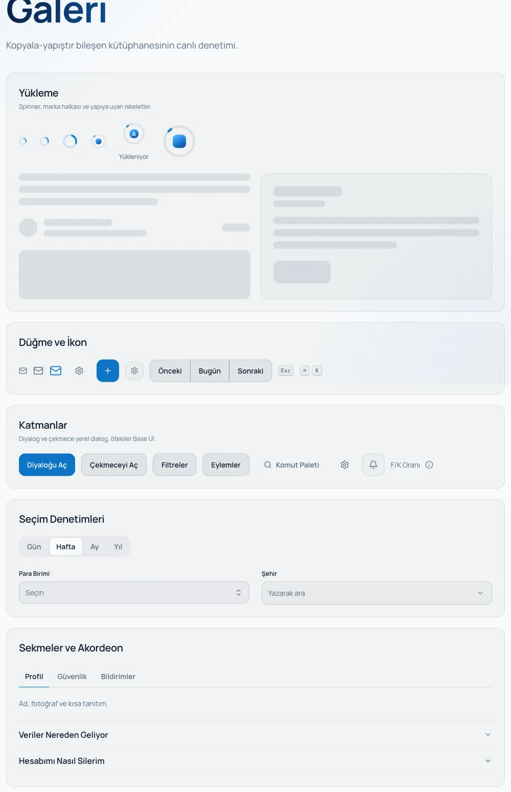</picture></td>
<td width="50%" valign="top"><picture><source media="(prefers-color-scheme: dark)" srcset=".github/readme/shots/ui-data-dark.webp">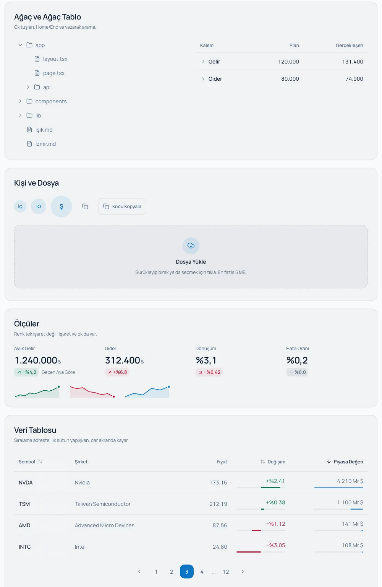</picture></td></tr>
<tr><td colspan="2"><picture><source media="(prefers-color-scheme: dark)" srcset=".github/readme/shots/ui-forms-dark.webp">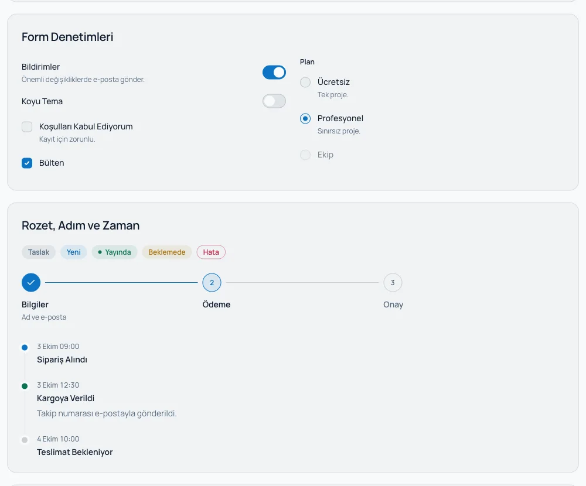</picture></td></tr>
</table>

### Fontlar

[`snippets/fonts`](snippets/fonts) on hazır eşleşme taşır (`signature`, `editorial`,
`longform`, `product`, `playful` …); hepsi `latin-ext` ve ğ, ş, İ, ı için ekranda
denetlendi. Ölçülerek bulunan tuzaklar rehberde: `₺` bazı ailelerde yok,
Schibsted Grotesk'te `tabular-nums` virgülü açıyor, `capitalize` Türkçede
`Istanbul` üretiyor. → [`guides/09-typography.md`](guides/09-typography.md)

→ [`guides/10-component-library.md`](guides/10-component-library.md) · [`snippets/ui/README.md`](snippets/ui/README.md)

---

## Rehberler

Yeni bir projeye başlarken sırayla okunur; her kuralın yanında "neden" ve hangi
projede yaşandığı yazar.

| # | Rehber | Ne Anlatır |
|---|---|---|
| 00 | [Marka Kimliği](guides/00-brand-identity.md) | Değişmezler, proje türüne göre palet ve tema seçimi, yeni paletin ölçülerek türetilmesi |
| 01 | [Kickoff](guides/01-kickoff.md) | `/kickoff`'tan ilk deploy'a ilk gün ve ilk hafta listesi |
| 02 | [Tasarım Token'ları](guides/02-design-tokens.md) | İki katman, rol adları, `-ink`/`-wash`, punto ve twMerge tuzakları, kontrast |
| 03 | [Tema](guides/03-theming.md) | Çerez + sunucuda `data-theme`, view transition'lı düğme, zemin katmanları |
| 04 | [Hareket](guides/04-motion.md) | LazyMotion, süre tablosu, Reveal kuralları, kaydırma ve sayfa geçişleri |
| 05 | [Bileşenler](guides/05-components.md) | Şablon bileşenleri, ekran düzeni sırası, boş/yükleme/hata durumları |
| 06 | [Next.js 16](guides/06-nextjs-16.md) | `proxy.ts`, async API'ler, önbellek katmanları, soft 404, React 19 formları |
| 07 | [Veri, Kimlik, Güvenlik](guides/07-data-auth-security.md) | Neon/Drizzle, migration disiplini, Auth.js sertleştirme, başlıklar |
| 08 | [Kalite ve Yayın](guides/08-quality-and-ship.md) | Commit kapıları, smoke betiği, CWV, erişilebilirlik, deploy listesi |
| 09 | [Tipografi](guides/09-typography.md) | Font eşleşmeleri, Türkçe glif kontrolü, punto ölçeği |
| 10 | [Bileşen Kütüphanesi](guides/10-component-library.md) | Başsız kütüphane kararı, klavye haritaları, a11y listesi |

---

## Ajanlar ve Komutlar

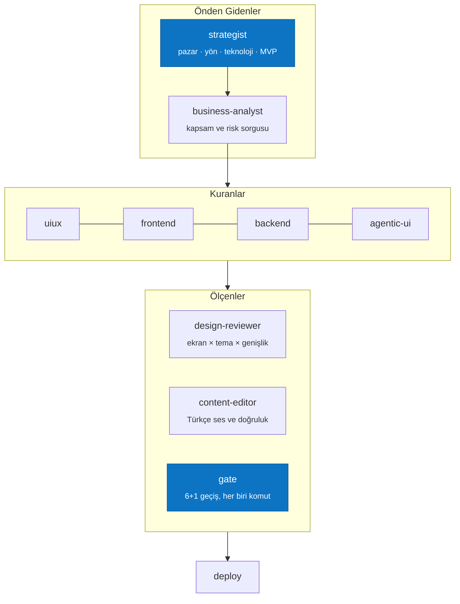

| Komut | Ne Yapar |
|---|---|
| `/kickoff [fikir]` | Fikri pazar taraması, yön seçenekleri, teknoloji kararları ve MVP planına çevirir |
| `/roadmap [odak]` | Var olan projede sıradaki en değerli 5 işi, fırsatları ve dokunulmayacakları önerir |
| `/new-project` | Şablon + palet + tema + belgeler + ilk doğrulama |
| `/theme` | Paleti ve temayı uygular ya da günceller |
| `/snippet <ad>` | Bileşeni projeye uyarlayarak kopyalar |
| `/review-ui` | Token, kimlik, iki tema, ekran düzeni, a11y ve hareket incelemesi |
| `/check` | Build, typecheck, lint, test, token ve güvenlik sağlık kontrolü |
| `/agentic` | Yapay zekâ arayüzünde aracın nerede, kontrolün hangi seviyede olacağı |
| `/deploy` | Vercel yayın listesi |
| `/release` | Sürüm, changelog, etiket |

`.claude/agents/` altındaki beş ajan (`strategist`, `design-reviewer`,
`content-editor`, `gate`, `deploy`) bootstrap ile `~/.claude/agents`'a bağlanır
ve **her projede** kullanılabilir. Rol tanımlarının tek kaynağı [`agents/`](agents).

---

## Bilgi Tabanı

| Dosya | İçerik |
|---|---|
| [`knowledge/mistakes.md`](knowledge/mistakes.md) | 93 yaşanmış hata: belirti, sebep, çözüm, hangi projede |
| [`knowledge/patterns.md`](knowledge/patterns.md) | 55 desen, projelerden toplanmış |
| [`knowledge/decisions.md`](knowledge/decisions.md) | Ekosistem kararları ve neden değiştikleri |
| [`knowledge/tech-radar.md`](knowledge/tech-radar.md) | İhtiyaç → teknoloji: benimse / dene / bekle |
| [`knowledge/themes/`](knowledge/themes) | 6 projenin görsel hafızası |
| [`knowledge/live-projects-audit.md`](knowledge/live-projects-audit.md) | Canlı projelerin denetimi |

---

## Kalite Kapıları

Her push'ta CI şunları koşar; biri kırmızıysa birleştirme yok.

| Kapı | Ne Doğrular |
|---|---|
| `npm test` | Token sözleşmesi, palet × tema kontrastı (WCAG AA), `theme.css` ↔ `tokens.ts` eşitliği |
| `lint` · `typecheck` · `build` | Paketler sıfır uyarıyla |
| `verify:exports` · `verify:lock` | Paket giriş noktaları, kilit dosyası tutarlılığı |
| `verify:readme` | Bu sayfadaki görseller token'larla güncel mi |
| `verify:agentic` | Agentic snippet'ler sabitlenmiş sürümlerle derleniyor mu |
| `test-hooks.sh` | Commit kancalarının davranışı |
| `health-check.sh` | Şablonlar yeni yığında mı (Tailwind v4, flat ESLint, `proxy.ts`, `motion`) |

---

## Yeni Makine

[`machine/bootstrap.sh`](machine/bootstrap.sh) tekrar çalıştırılması güvenli bir
kurulum betiği: global `CLAUDE.md`'yi, komutları, ajanları ve depoda taşınan
skill'leri `~/.claude`'a **bağlar** (kopyalamaz; tek kaynak burada kalır),
kullanılan taste-skill parçalarını kurar, üzerine yazdığı her şeyi önce yedekler.
`--dry-run` ile ne yapacağını önceden gösterir. İzin listesi bilinçli olarak
taşınmaz; claude.ai eklentileri girişle kendiliğinden gelir.
→ [`machine/README.md`](machine/README.md)

---

<details>
<summary><b>Depo Haritası</b></summary>

```text
dev-starter/
├── guides/            00-10 · projeye başlarken sırayla okunan rehberler
├── templates/
│   ├── nextjs-fullstack/   Next 16 · Auth.js · Neon/Drizzle · CI
│   ├── landing/            7 hero düzeni · içerik tek dosyada
│   ├── agentic-chat/       AG-UI overlay
│   └── docs/               KICKOFF · PRODUCT · ROUTEMAP · ARCHITECTURE · SCREENS · DESIGN
├── snippets/
│   ├── ui/            kopyala-yapıştır bileşen kütüphanesi
│   ├── fonts/         Türkçe glif kontrolünden geçmiş font eşleşmeleri
│   └── *.tsx          reveal · theme-toggle · rolling-number · modal · toast …
├── packages/@ahmet/
│   ├── theme/         theme.css (sistem + palet) · tokens.ts · index.css
│   └── ui/            Surface · Button · motion varyantları · cn()
├── agents/            10 rol tanımı + AGENT_PROTOCOL
├── .claude/
│   ├── agents/        strategist · design-reviewer · content-editor · gate · deploy
│   └── commands/      10 komut
├── knowledge/         mistakes · patterns · decisions · tech-radar · themes
├── rules/             8 kural
├── phases/            planlama · uçtan uca cila · yayın ve bakım
├── hooks/             gate-guard · quality-scan · routemap-sync
├── scripts/           health-check · audit-project · verify-* · build-readme-assets
└── machine/           bootstrap.sh · global CLAUDE.md · taşınan skill'ler
```

</details>

<sub>MIT · Ahmet Akyapı · Değişiklik geçmişi: [CHANGELOG](CHANGELOG.md) · Katkı: [CONTRIBUTING](CONTRIBUTING.md)</sub>
